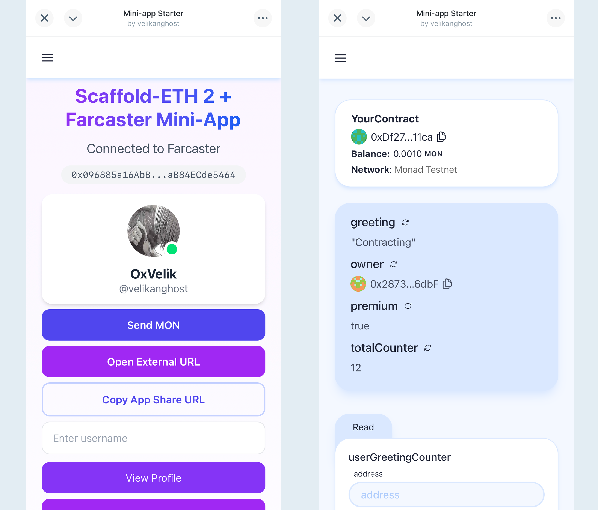

# 🏗 Scaffold-ETH 2 + Farcaster Mini-App Template

<h4 align="center">
  <a href="https://docs.scaffoldeth.io">Scaffold-ETH 2</a> |
  <a href="https://miniapps.farcaster.xyz/docs/getting-started">Farcaster Mini-App</a>
</h4>

🧪 An open-source, up-to-date toolkit for building decentralized applications (dapps) on Monad and other blockchain integrated with Farcaster Mini-Apps. It's designed to make it easier for developers to create and deploy smart contracts and build user interfaces that interact with those contracts while leveraging Farcaster's social features.

⚙️ Built using NextJS, Foundry, Farcaster Frame SDK, Wagmi, Viem, Typescript, and Neynar.

## Features

### Scaffold-ETH 2 Features

- ✅ **Contract Hot Reload**: Your frontend auto-adapts to your smart contract as you edit it.
- 🪝 **[Custom hooks](https://docs.scaffoldeth.io/hooks/)**: Collection of React hooks wrapper around [wagmi](https://wagmi.sh/) to simplify interactions with smart contracts with typescript autocompletion.
- 🧱 [**Components**](https://docs.scaffoldeth.io/components/): Collection of common web3 components to quickly build your frontend.
- 🔥 **Burner Wallet & Local Faucet**: Quickly test your application with a burner wallet and local faucet.

### Farcaster Mini-App Features

- 🖼️ **Frame Configuration**: Pre-configured `.well-known/farcaster.json` endpoint for Frame metadata and account association
- 🔐 **Integration with Farcaster Wallet**: Connect to farcaster wallet and interact with the default monad network.
- 🔔 **Background Notifications**: Redis-backed notification system using Upstash
- 🛠️ **MiniApp Provider**: Built-in context provider for Farcaster Mini-App functionality
- 🎨 **Dynamic Preview Images**: Support for custom preview images in your frames



## Farcaster Frame Features

### Frame Configuration

The template comes with pre-configured Frame metadata and account association:

- `.well-known/farcaster.json` endpoint is set up for Frame metadata
- Frame metadata is automatically added to page headers in `layout.tsx`
- Account association is required for user notifications.

### Background Notifications

Built-in notification system powered by Redis/Upstash:

- Ready-to-use notification endpoint in `utils/notifs.ts`
- Notification utilities in `utils/kv.ts`
- KV store implementation for storing user notification preferences

### MiniApp Provider

The app is wrapped with `MiniAppProvider` in `contexts/miniapp-context.tsx`, providing:

- Access to Farcaster Mini App context
- Frame SDK integration
- Notification management
- User authentication

### Dynamic Preview Images

Support for dynamic OG images in your Frames:

- Example implementation in `app/api/og/route.tsx`
- Customizable templates for Frame previews
- Real-time image generation based on Frame content

## Requirements

Before you begin, you need to install the following tools:

- [Node (>= v18.18)](https://nodejs.org/en/download/)
- Yarn ([v1](https://classic.yarnpkg.com/en/docs/install/) or [v2+](https://yarnpkg.com/getting-started/install))
- [Git](https://git-scm.com/downloads)

## Quickstart

To get started with this Scaffold-ETH 2 Farcaster Mini-App template, follow these steps:

1. Install dependencies:

```bash
cd se2-foundry-monad
yarn install && forge install --root packages/foundry
```

- if you run into issues with forge-std files, run

```bash
cd packages/foundry
rm -rf lib/forge-std && forge install foundry-rs/forge-std --no-commit
```

2. Run a local network in the first terminal:

```bash
yarn chain
```

This command starts a local Ethereum network using Foundry. The network runs on your local machine and can be used for testing and development. You can customize the network configuration in `packages/foundry/foundry.toml`.

3. On a second terminal, deploy the test contract:

```bash
yarn deploy
```

This command deploys a test smart contract to the local network. The contract is located in `packages/foundry/contracts` and can be modified to suit your needs. The `yarn deploy` command uses the deploy script located in `packages/foundry/script` to deploy the contract to the network.

4. Copy the `.env.example` file to `.env.local` and fill in the values

The environment variables enable the following features:

- Frame metadata - Sets up the Frame Embed that will be shown when you cast your frame
- Account assocation - Allows users to add your frame to their account, enables notifications
- Redis API keys - Enable Webhooks and background notifications for your application by storing users notification details

```bash
cp .env.example .env.local
```

5. Start the development server:

```bash
yarn start
```

6. Run a local tunneling server (required for Farcaster Frame development):

- Use [CLOUDFLARE](https://developers.cloudflare.com/cloudflare-one/connections/connect-networks/downloads/) or [Local Tunnel](https://theboroer.github.io/localtunnel-www/)

  Here we use cloudflare like this, run

  ```bash
  cloudflared tunnel --url http://localhost:3000
  ```

- This will allow your local development server to be accessible from the internet
- Also copy the generated domain to your NEXT_PUBLIC_URL in your `.env` file

7. Generate your Farcaster Manifest variables

- Follow these [instructions](https://miniapps.farcaster.xyz/docs/guides/publishing)
- Visit [Manifest Tool](https://farcaster.xyz/~/developers/mini-apps/manifest)
- Paste your tunnel domain

You can:

- Interact with your smart contract using the `Debug Contracts` page
- Test your Farcaster Mini-App
- Configure your scaffold in `packages/nextjs/scaffold.config.ts`

## Development

- Edit your smart contracts in `packages/foundry`
- Edit your frontend in `packages/nextjs`
- Edit your deployment scripts in `packages/foundry/script`
- Configure your Frame metadata in `.well-known/farcaster.json`

## Deploying to Monad

### Smart Contracts

First, check out the existing `.env` file and fill in the necessary values:

```
MONAD_RPC_URL=
MONAD_SOURCIFY_VERIFIER_URL=

# Do not change the name of the variable below, put Monad chain id here
FOUNDRY_CHAIN_ID=
```

Also, change the `ETH_KEYSTORE_ACCOUNT` to `scaffold-eth-custom` to deploy!

Then, run the following command to deploy your contract to Monad:

```
yarn deploy --network monad
```

To verify your contract, run the following command:

```
yarn verify --network monad
```

To run both deploy and verify, run the following command:

```
yarn deploy --network monad && yarn verify --network monad
```

### Frontend

First, copy the `.env.example` file to `.env.local` and fill in the values.

Then, change the target network in `packages/nextjs/scaffold.config.ts` to `monad`

```
targetNetworks: [monad],
```

Then, run the following command to deploy your nextjs app to production:

```
yarn vercel
```

You should be able to see a URL to your app on Vercel.

## Documentation

- [Scaffold-ETH 2](https://docs.scaffoldeth.io)
- [Farcaster Mini Apps](https://miniapps.farcaster.xyz/docs/getting-started)
- [Next.js Documentation](https://nextjs.org/docs)
- [Tailwind CSS Documentation](https://tailwindcss.com/docs)
- [Neynar](https://neynar.com)

## Contributing to Scaffold-ETH 2

We welcome contributions to Scaffold-ETH 2!

Please see [CONTRIBUTING.MD](https://github.com/scaffold-eth/scaffold-eth-2/blob/main/CONTRIBUTING.md) for more information and guidelines for contributing to Scaffold-ETH 2.
